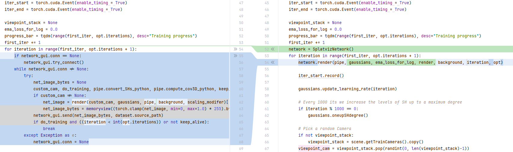
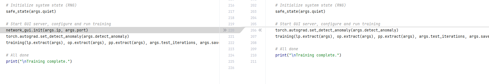

#  splatviz network
In order to edit the scene while it is still training, you will have to use the custom splatviz network connector. To do so, follow the four simple steps:

### Step 1
Install the network connector to your training project environment.

```sh
pip install splatviz-network
```

### Step 2 
At the beginning of the train script, create the network connector:
```python
from splatviz_network import SplatvizNetwork
network = SplatvizNetwork()
```

### Step 3
Call the render function inside the training loop:
```python
network.render(pipe, gaussians, ema_loss_for_log, render, background, iteration, opt)
```

### Step 4
Remove all previously defined `network_gui` calls in the train script.

## Example Diff
For the vanilla 3DGS train.py the diff should look as follows: 


...



